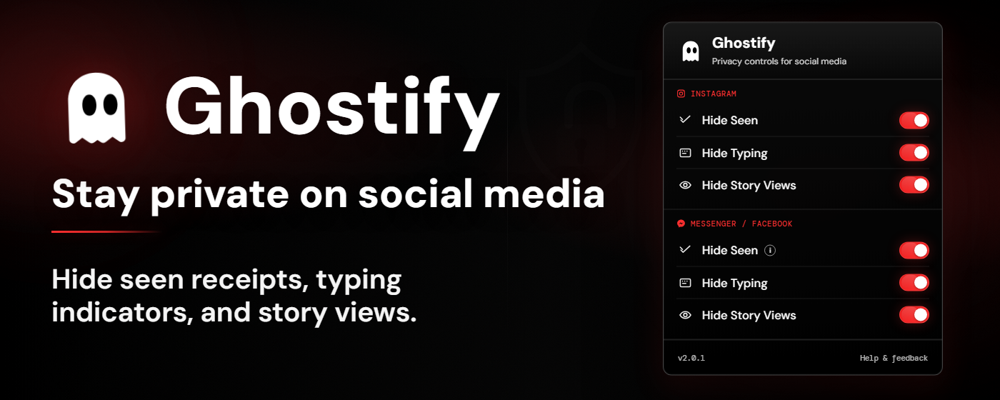

# Hi, I'm Hendrixxzx

Computer Science student at Saint Louis University in Baguio, Philippines.  
I build browser extensions, backend APIs, and local-first developer tools.

I like shipping practical software, especially tools that automate annoying workflows, improve privacy, or make everyday systems more reliable.

  

  
  
  

## Focus

- Backend development with Java, Spring Boot, REST APIs, SQL, and PostgreSQL
- Browser extension development with JavaScript, Manifest V3, content scripts, Chrome APIs, and browser storage
- Local-first tools for privacy, automation, diagnostics, and Windows developer workflows
- Testing and quality practices with Playwright, pytest, ruff, validation, and structured debugging

## Featured Work

### [Ghostify](https://github.com/Hendrizzzz/Ghostify)

Privacy-focused browser extension for Instagram, Facebook, and Messenger. Ghostify gives users local controls for read receipts, typing indicators, and story view visibility without collecting personal data.

  

What I built:

- Published a Manifest V3 extension with 700+ Chrome users and a Microsoft Edge Add-ons listing
- Built local-only privacy controls with no backend, account system, or user tracking
- Implemented content scripts and declarative network rules for supported social platforms
- Added browser-local settings storage for per-feature controls
- Packaged Chromium builds with an ESBuild pipeline and modular service-worker/content-script structure
- Built and deployed a public landing page for the extension

Links:

- [Landing page](https://ghostify-extension.vercel.app/)
- [Chrome Web Store](https://chromewebstore.google.com/detail/ghostify-hide-seen-typing/flpnibonbhdmnpgflnbemgghghhblmpm?hl=en)
- [Microsoft Edge Add-ons](https://microsoftedge.microsoft.com/addons/detail/ghostify-hide-seen-typ/mgbppdkolkeelimnemlbpmfdddhoeeal)
- [Demo post](https://www.linkedin.com/posts/jim-hendrix-bag-eo_inspired-by-hyowons-work-on-messengerz-for-ugcPost-7429904469968056320-XoVg)
- [Source code](https://github.com/Hendrizzzz/Ghostify)

---

## Tech I Use Often

Java, Spring Boot, JavaScript, TypeScript, Chrome Extensions, React, Tauri, Rust, Python, Playwright, PostgreSQL, MySQL, Docker, Git, Bash

## Contact

- LinkedIn: <https://www.linkedin.com/in/jim-hendrix-bag-eo/>
- Email: <jimhendrixbageo@gmail.com>
- Discord: [hendrixzzz](https://discord.com/users/1263809203823186012)
