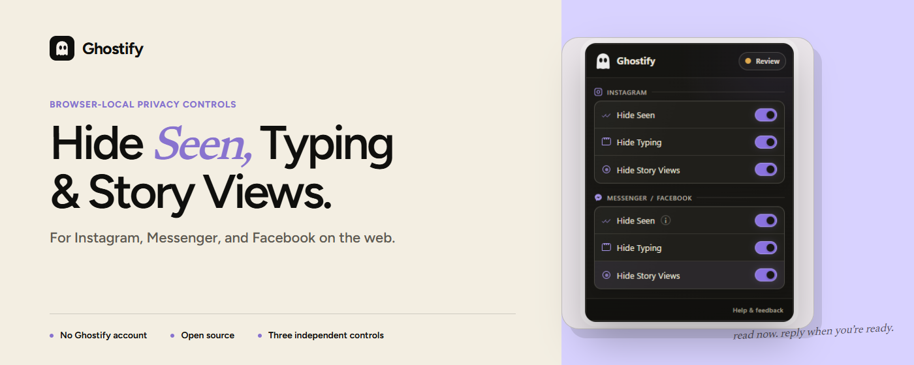

# Hi 👋, I'm Hendrix

3rd year CS student at Saint Louis University, based in Baguio.  
I build browser tools, desktop workflows, and backend systems.

I like shipping things that solve annoying problems and figuring out the hard parts when they break.

  

  
  </a>
  

## What I’m strongest at

Java / Spring Boot, Chrome extensions, JS / browser internals, Electron, debugging, and system thinking.

## Currently building

- Quickpass, a USB-based portable workspace app
- Ghostify docs, UIs, and polish
- Social app rating

## Featured work

### [Ghostify](https://github.com/Hendrizzzz/Ghostify)
Chrome extension for FB/IG/Messenger privacy. Hides seen receipts, typing indicators, and story views. Already live with real users.

  

What I built:
- Intercepts browser behavior in the page context
- Uses Chrome extension APIs and request handling
- Handles WebSocket inspection for Messenger behavior
- Shipped on Chrome Web Store and Microsoft Edge Add-ons

Links:
- Live: [Chrome Web Store](https://chromewebstore.google.com/detail/ghostify-hide-seen-typing/flpnibonbhdmnpgflnbemgghghhblmpm?hl=en&authuser=1)
- Live: [Microsoft Edge Add-ons](https://microsoftedge.microsoft.com/addons/detail/ghostify-hide-seen-typ/mgbppdkolkeelimnemlbpmfdddhoeeal)
- Demo: [LinkedIn post](https://www.linkedin.com/posts/jim-hendrix-bag-eo_inspired-by-hyowons-work-on-messengerz-for-ugcPost-7429904469968056320-XoVg?utm_source=social_share_send&utm_medium=member_desktop_web&rcm=ACoAAFLLzCsBl8wBO8dadU4EVqYqNymBuLRx2Wc)
- Code: [GitHub repo](https://github.com/Hendrizzzz/Ghostify)

---

### [Quickpass](https://github.com/Hendrizzzz/Quickpass)
Portable workspace app for USB-based workflows. Built around encryption, Playwright sessions, and fast local workspace launch.

  

What I built:
- USB-bound workspace unlock flow
- AES-256-GCM + PBKDF2 encryption
- Playwright-based browser session handling
- Local temp sync and cleanup logic

Links:
- Code: [GitHub repo](https://github.com/Hendrizzzz/QuickPass)
- Demo: coming soon
- Writeup: coming soon

## Tech I use often

Java, Spring Boot, JavaScript, Chrome Extensions, PHP, Python, Kotlin, Electron, Playwright, MySQL, PostgreSQL, Docker, Git, Bash

## Contact

- LinkedIn: https://www.linkedin.com/in/jim-hendrix-bag-eo/
- Email: jimhendrixbageo@gmail.com
- Discord: [hendrixzzz](https://discord.com/users/1263809203823186012)

